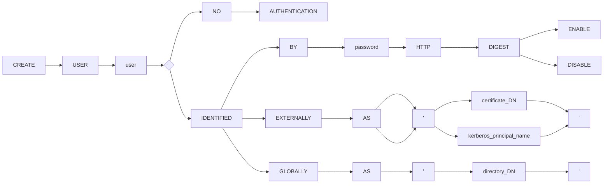
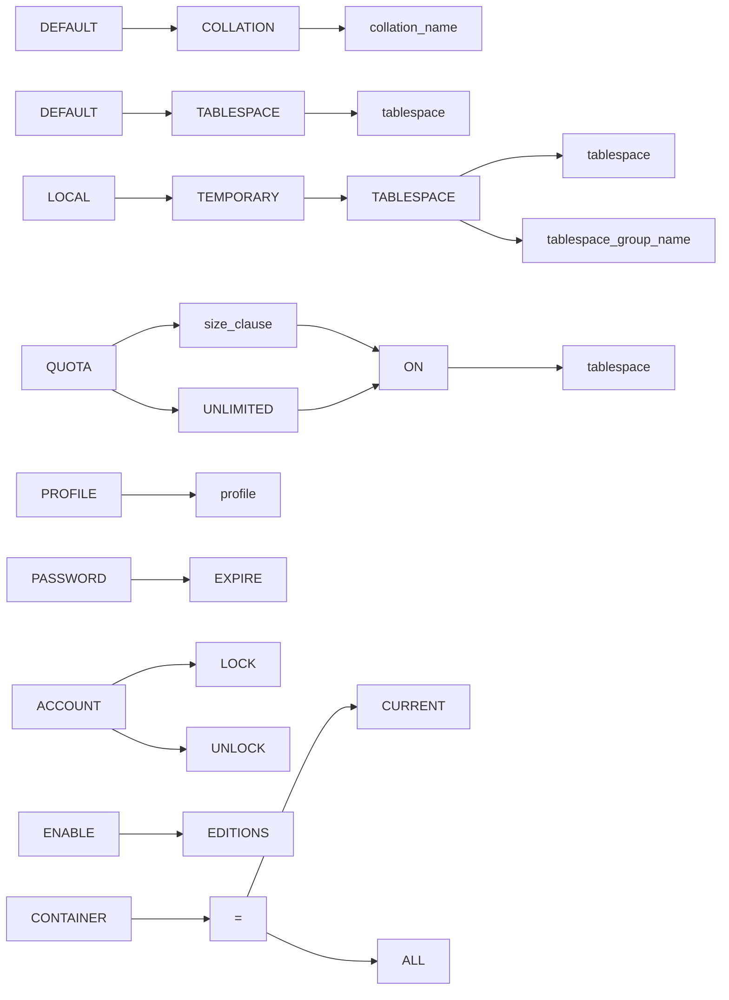
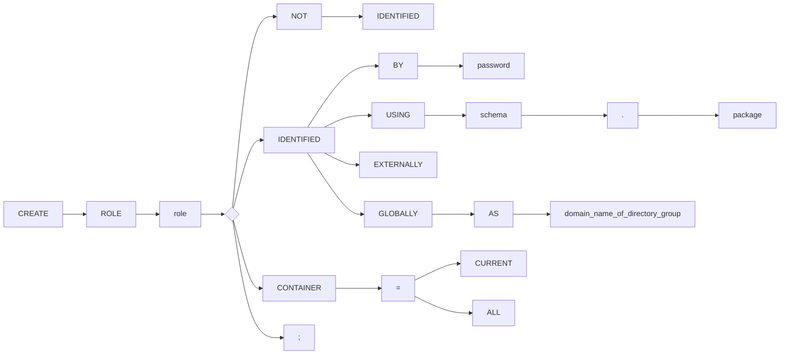

# CH04 - 2024


<!-- page 1 -->

ITDE
INFORMATION TECHNOLOGY & DIGITAL ECONOMICS
BANKING ACADEMY OF VIETNAM

# QUẢN TRỊ CƠ SỞ DỮ LIỆU

**Giảng viên: Ngô Thùy Linh**

ORACLE

Khoa Hệ thống thông tin quản lý – Học viện Ngân Hàng


<!-- page 2 -->

# NỘI DUNG

## 4.1. Kiến trúc cơ sở dữ liệu Oracle
## 4.2. Quản trị Oracle Net Service
## 4.3. Quản lý người dùng
## 4.4. Sao lưu và phục hồi


<!-- page 3 -->

ITDE
INFORMATION TECHNOLOGY & DIGITAL ECONOMICS
BANKING ACADEMY OF VIETNAM

## 4.1. KIẾN TRÚC CƠ SỞ DỮ LIỆU ORACLE

- Kiến trúc Oracle Application
- Kiến trúc Oracle Database
- Cấu trúc lưu trữ Oracle Database

ORACLE


<!-- page 4 -->

# Kiến trúc Oracle Application

Client $\rightarrow$ HTTP request $\rightarrow$ Internet $\rightarrow$ Application server (App server, Oracle Net) $\rightarrow$ TCP/IP $\rightarrow$ Database server (RDBMS, Oracle Net)

- Trong môi trường Oracle Database, ứng dụng cơ sở dữ liệu và cơ sở dữ liệu được tách biệt thành một kiến trúc **máy khách/chủ (Client/Server)**.
- *Client (Máy khách)*: chạy ứng dụng CSDL, truy cập thông tin CSDL và tương tác với người dùng.
- *Server (Máy chủ)*: chạy phần mềm CSDL Oracle và xử lý các chức năng cần thiết cho việc truy cập đồng thời và chia sẻ dữ liệu.


<!-- page 5 -->

# Kiên trúc Oracle Application

## Kiên trúc đa tầng

- **Thin Client**
- **HTTPS Request**
- **Database Server**
- **Database**
- **RDBMS**
- **Oracle Net**
- **Data**
- **Query**
- **Application Server 1**
- **Application Server 2**
- **Application Server n**
- **Application**

ORACLE


<!-- page 6 -->

# Kiến trúc Oracle Application

- **Clients**
    - Client khởi tạo yêu cầu trên Database server.
    - Client kết nối với Database server thông qua một hoặc nhiều Application servers.

- **Application Servers**
    - Cung cấp quyền truy cập dữ liệu cho Client.
    - Cung cấp giao diện giữa Client với một hoặc nhiều Database servers.

- **Database Servers**
    - Cung cấp dữ liệu do Application Servers (thay mặt cho Client yêu cầu).
    - Cơ sở dữ liệu thực hiện xử lý truy vấn.


<!-- page 7 -->

# Kiến trúc Oracle Application

- **Client Application** (client process)
- **Connect Packet**
- **Listener**
- **Database Server**
    - **Database Instance** (memory and processes)
        - **Server Process**
    - **Database**
        - **Data Files**
        - **System Files**

**Processes SQL**
**Connects**
**Accesses**

Trong một Oracle Databse có ít nhất một Database Instance và một Database


<!-- page 8 -->

# Kiến trúc Oracle Application

## SGA
- Database Buffer Cache
- Shared Pool
- Redo Log Buffer

## Quy trình kết nối
1. **Connection Request**: Client gửi yêu cầu kết nối đến Listener.
2. **Here's Your Client**: Listener chuyển tiếp thông tin đến Server.
3. **Meet Your Server**: Server xác nhận kết nối với Client.
4. **Let's Talk**: Client bắt đầu giao tiếp với Server.

## Các thành phần khác
- **Server**
- **Datafiles**
- **Client**
- **Listener**
- **NETWORK**

ORACLE


<!-- page 9 -->

# Kiến trúc Oracle Application

### **Oracle Net Listener** (listener)

- Là một quy trình phía server, lắng nghe các yêu cầu kết nối từ Client và quản lý lưu lượng truy cập vào cơ sở dữ liệu.
- Khi một database instance bắt đầu và trong thời gian tồn tại của nó, instance đó sẽ liên hệ với một listener và thiết lập một đường dẫn truyền thông đến instance này.


<!-- page 10 -->

# Kiến trúc Oracle Application

## Kiến trúc listener

- **Client** (Web Browser): HTTP(S) Presentation over TCP/IP
- **Client**: Database Connection over TCP/IP
- **Listener**
- **Database**

1. Kết nối từ Client đến Listener
2. Kết nối từ Listener đến Database
3. Kết nối trực tiếp từ Client đến Database

ORACLE


<!-- page 11 -->

# Oracle Architecture

- **Database Server**
- **Oracle Instance**
    - An Oracle instance consists of processes and memory on the database server
- **Oracle Database**
    - An Oracle database consists of physical files on the disk

ORACLE


<!-- page 12 -->

# Kiên trúc Oracle Database

- Một Oracle database server gồm:
    - **Process structure**
    - **Memory structure**
    - **Storage structure**

Trong đó,
**Process**+**Memory**->**instance**
**Stotage** -> **database**

---

### Các thành phần trong sơ đồ:

| Cấu trúc | Thành phần chi tiết |
| :--- | :--- |
| **Instance** | Server Process 1, Server Process 2, PGA, SGA, Background Processes |
| **Physical Database Structure** | Data Files, Control Files, Redo Log Files, Archive Log Files, Password Files, Parameter Files, Datafile 1-5 |
| **Logical Database Structure** | SYSTEM Tablespace, SYSAUX Tablespace, Tablespace 1, Tablespace 2 |

**Các tiến trình nền (Background Processes):**
- DBWn
- CKPT
- LGWR


<!-- page 13 -->

# Kiến trúc Oracle Database

- **INSTANCE**: là một tập hợp các **tiến trình của hệ thống** chạy background (background processes) cùng với **thành phần bộ nhớ** có cấu trúc nhất định (memory structures) để thao tác lên **1 database** nào đó
- **DATABASE**: là 1 **tập hợp các file** (ở mức vật lý) có **chứa dữ liệu** của người dùng và các dữ liệu khác gồm data files, temporary files, redo log files và control file.

**Instance + Database = 1 Oracle database system**


<!-- page 14 -->


<!-- page 15 -->

# Instance

## System Global Area (SGA)

- **Shared Pool**
    - **Library Cache**
        - **Shared SQL Area** (`SELECT * FROM employees`)
        - **Private SQL Area** (Shared Server Only)
    - **Data Dictionary Cache**
    - **Server Result Cache**
    - **Other**
    - **Reserved Pool**
- **Large Pool**
    - Free Memory
    - I/O Buffer Area
    - UGA
    - Response Queue
    - Request Queue
- **Database Buffer Cache**
- **Redo Log Buffer**
- **Fixed SGA**
- **Java Pool**
- **Streams Pool**

## Background Processes

- PMON
- SMON
- RECO
- MMON
- MMNL
- Others
- DBWn
- CKPT
- LGWR
- ARCn
- RVWR

## PGA

- SQL Work Areas
- Session Memory
- Private SQL Area

## Server Process

## Client Process

## Database

- **Data Files**
- **Control Files**
- **Online Redo Log**
- **Archived Redo Log**
- **Flashback Log**

# Oracle Instance and Database


<!-- page 16 -->

# Oracle Database Instance

**Database instance** (Instance) là tập hợp các cấu trúc bộ nhớ, quản lý các tệp cơ sở dữ liệu

## Database Server

### Database Instance
- System Global Area (SGA)
- Program Global Areas (PGAs)
- Background Processes
- Server Processes

### Client Applications
- Processes SQL

### Database

---
Maintains
- Server Processes -> Program Global Areas (PGAs)
- Background Processes -> System Global Area (SGA)
- Background Processes -> Program Global Areas (PGAs)
- Server Processes -> Database
- Background Processes -> Database


<!-- page 17 -->

# Oracle Database Instance

## Single-Instance Database
- **Database Instance**
- **Database**
    - **Data Files**
    - **Control Files**
    - **Online Redo Log**

## Oracle RAC Database
- **Database Instance**
- **Database Instance**
- **Database**
    - **Data Files**
    - **Control Files**
    - **Online Redo Log**

### Cấu hình Database Instance


<!-- page 18 -->

# Oracle Database Instance

- Tại một thời điểm, một database instance có thể tự liên kết với một và chỉ một cơ sở dữ liệu. Sau khi một CSDL bị đóng hoặc tắt, chúng ta phải khởi động một instance khác để gắn và mở CSDL.

## Trình tự khởi động instance và cơ sở dữ liệu

| Trạng thái | Mô tả |
| :--- | :--- |
| **NOMOUNT** | Instance started |
| **MOUNT** | Control file opened for this instance |
| **OPEN** | Database opened for this instance |

## Trình tự tắt instance và cơ sở dữ liệu

| Trạng thái | Mô tả |
| :--- | :--- |
| **OPEN** | Database opened for this instance |
| **CLOSE** | Database closed and control file opened |
| **NOMOUNT** | Control file closed and instance started |
| **SHUTDOWN** | Shutdown |


<!-- page 19 -->

# Kiến trúc bộ nhớ Oracle Database

- Khi khởi động một instance, Oracle Database phân bổ một vùng bộ nhớ và khởi động các background processes
- Vùng bộ nhớ lưu trữ thông tin như sau:
    - Mã chương trình
    - Thông tin về mỗi session được kết nối, ngay cả khi hiện nó không hoạt động
    - Thông tin cần thiết trong quá trình thực thi chương trình, ví dụ: trạng thái hiện tại của truy vấn
    - Thông tin như dữ liệu khóa được chia sẻ và giao tiếp giữa các processes
    - Dữ liệu được lưu trong bộ nhớ đệm, chẳng hạn như khối dữ liệu và bản ghi redo.


<!-- page 20 -->

# Kiến trúc bộ nhớ Oracle Database

## Instance

### System Global Area (SGA)

- **Shared Pool**
    - **Library Cache**
        - **Shared SQL Area** (`SELECT * FROM employees`)
        - **Private SQL Area** (Shared Server Only)
    - **Data Dictionary Cache**
    - **Server Result Cache**
    - **Other**
    - **Reserved Pool**
- **Large Pool**
    - Free Memory
    - I/O Buffer Area
    - UGA
    - Response Queue
    - Request Queue
- **Database Buffer Cache**
- **Redo Log Buffer**
- **Fixed SGA**
- **Java Pool**
- **Streams Pool**

### PGA

- **SQL Work Areas**
- **Session Memory**
- **Private SQL Area**
- **Server Process**

---

**Client Process**

ORACLE


<!-- page 21 -->

# Kiến trúc bộ nhớ Oracle Database

- Các cấu trúc bộ nhớ cơ bản của Oracle Database
- **System global area (SGA)**
    - Là một nhóm các cấu trúc bộ nhớ dùng chung, chứa dữ liệu và thông tin điều khiển cho một Oracle Database instance.
    - Dùng chung cho cả server và background processes
- **Program global area (PGA)**
- **User global area (UGA)**
- **Software code areas**


<!-- page 22 -->

# System global area (SGA)

### Các thành phần quan trọng của SGA

- Database Buffer Cache
- In-Memory Area
- Redo Log Buffer
- Shared Pool
- Large Pool
- Java Pool
- Fixed SGA

---

**Sơ đồ cấu trúc System Global Area (SGA):**

| Thành phần chính | Chi tiết cấu trúc |
| :--- | :--- |
| **Shared Pool** | Library Cache (Shared SQL Area, Private SQL Area), Data Dictionary Cache, Server Result Cache, Other, Reserved Pool |
| **Large Pool** | Response Queue, Request Queue |
| **Các thành phần khác** | Database Buffer Cache, Redo Log Buffer, Fixed SGA, Java Pool, Streams Pool |


<!-- page 23 -->

# System global area (SGA)

## **Database Buffer Cache**:

- Còn được gọi là bộ đệm, là vùng bộ nhớ lưu trữ các bản sao của khối dữ liệu được đọc từ các tệp dữ liệu.
- Trình quản lý lưu khối dữ liệu hiện tại hoặc được sử dụng gần đây vào bộ nhớ đệm.
- Tất cả người dùng kết nối với một database instance đồng thời được chia sẻ quyền truy cập vào buffer cache.


<!-- page 24 -->

# System global area (SGA)

- Khi 1 session cần dữ liệu, Oracle sẽ kiểm tra có trong **Database buffer cache** chưa. Nếu có rồi thì đọc luôn trong buffer cache. Nếu chưa có, Oracle sẽ phải đọc từ thiết bị lưu trữ lên.

- **Trạng thái buffer**:
    - Unused
    - Clean
    - Dirty

**Server process**
**SGA**
**Database buffer cache**
**DBWn**
**Data files**


<!-- page 25 -->

# System global area (SGA)

**Extended Database Buffer Cache**

- **In-Memory Buffer Cache**
- **Flash Cache**

**Buffer Search**

ORACLE


<!-- page 26 -->

# System global area (SGA)

* **Redo Log Buffer**:
    - Là phần bộ nhớ chứa những thay đổi trên database, do các câu lệnh DML, DDL hay do các hoạt động nội bộ trong database.


*Chú thích sơ đồ:*
- **Database Buffer Cache**
- **Redo Log Buffer**
- **PGA** (SQL Work Areas, Session Memory, Private SQL Area)
- **Server Process**
- **LGWR**
- **Online Redo Log**


<!-- page 27 -->

# System global area (SGA)

- Khi **Redo log buffer** đầy 1/3 hoặc cứ sau mỗi 3 giây, **Log writer process** sẽ ghi vào **Redo log files**, để lấy chỗ cho những nội dung thay đổi mới.
- Do **Redo log buffer** chứa những thay đổi trên database, nên để đảm bảo toàn vẹn dữ liệu, 1 transaction chỉ được coi là đã commit khi đã ghi những thay đổi trong **Redo log buffer** vào **Redo log files**, đảm bảo nếu có sự cố có thể khôi phục được những thay đổi gần nhất.


<!-- page 28 -->

# System global area (SGA)

## **Shared Pool**

- Chứa những câu lệnh SQL, PL/SQL đã thực thi

- Là tập hợp các bảng và view chứa thông tin về CSDL, cấu trúc và người dùng của CSDL

- Là bộ nhớ đệm chứa tập kết quả (không phải chứa các khối dữ liệu như buffer pools)

### Cấu trúc Shared Pool

| Thành phần | Nội dung chi tiết |
| :--- | :--- |
| **Library Cache** | **Shared SQL Area**<br>- Parsed SQL Statements<br>- SQL Execution Plans<br>- Parsed and Compiled PL/SQL Program Units |
| **Private SQL Area** | (Shared Server Only) |
| **Data Dictionary Cache** | Dictionary Data Stored in Rows |
| **Server Result Cache** | SQL Query Result Cache<br>PL/SQL Function Result Cache |
| **Other** | |
| **Reserved Pool** | |


<!-- page 29 -->

# System global area (SGA)

**CSDL cho mỗi câu lệnh SQL được thực hiện**: Kiểm tra Shared SQL Area xem có tồn tại câu lệnh giống (ngữ pháp & ngữ nghĩa), nếu có thì thực thi luôn, nếu không thì được cấp phát một Share SQL Area mới.

**Private SQL area**: phụ thuộc vào việc thiết lập kết nối của một session, nếu được kết nối qua server thì một phần của nó sẽ được giữ trong SGA.

---
*Hình ảnh minh họa:*
- **Instance**
- **System Global Area (SGA)**
    - **Shared Pool**
        - **Library Cache**
            - **Shared SQL Area** (`SELECT * FROM employees`)
            - **Private SQL Area** (Shared Server Only)
        - Data Dictionary Cache
        - Server Result Cache
        - Other
        - Reserved Pool
- **PGA**
    - Server Process
    - SQL Work Areas
    - Session Memory
    - **Private SQL Area** (`SELECT * FROM employees`)
- **Client Process**


<!-- page 30 -->

# System global area (SGA)

## **Large Pool**:
- Cấp phát bộ nhớ lớn cho các tác vụ đặc biệt như:
- UGA cho máy chủ và giao diện Oracle XA
- Bộ đệm cho các xử lý song song
- Bộ đệm cho I/O của Recovery Manager (RMAN)
- Bộ đệm cho các lần insert


<!-- page 31 -->

# System global area (SGA)

## Large Pool

**Database Instance**

**System Global Area (SGA)**

**Large Pool**

- Free Memory
- I/O Buffer Area
- User Global Area (UGA)
- Deferred Inserts Pool
- Request Queue
- Response Queues

**(Dedicated server configuration)**

- Client Application
- Client Application
- Client Application

**Dedicated Server Process**

(1) Sends request
(2) Places request
(3) Picks up request
(4) Retrieves data
(5) Places response
(6) Sends response
(7) Returns response

**(Shared server configuration)**

- Dispatcher
- Shared Server Processes

Data
Shares Information
Data


<!-- page 32 -->

# System global area (SGA)

**Java Pool**: Là một vùng bộ nhớ lưu trữ tất cả mã và dữ liệu Java dành riêng cho Java Virtual Machine (JVM)

- **Fixed SGA** gồm:
    - Thông tin chung về trạng thái của cơ sở dữ liệu và instance mà các background processes cần truy cập
    - Thông tin được trao đổi giữa các processe

- **In-Memory Area**
    - Chứa In-Memory Column Store (IM column store): chứa bản sao của bảng, partition cụ thể hóa bằng định dạng cột.
    - IM column store bổ sung cho database buffer cache


<!-- page 33 -->

# Program global area (PGA)

- **PGA** là phần bộ nhớ riêng cho mỗi server process hay background process


*Ghi chú sơ đồ:*
- **Client Process** kết nối tới **Server Process**.
- **Server Process** tạo ra **Program Global Area (PGA)**.
- **PGA** bao gồm:
    - **Stack Space**
    - **Hash Area**
    - **Bitmap Merge Area**
    - **User Global Area (UGA)**:
        - **SQL Work Areas**: **Sort Area**
        - **Session Memory**: **Session Variables**, **OLAP Pool**
        - **Private SQL Area**: **Persistent Area**, **Runtime Area**
- **Client Process** có **Data Area** và **Pointer** trỏ tới **cursor** (trong **Private SQL Area**).


<!-- page 34 -->

# Program global area (PGA)

- **Phân bổ riêng của bộ nhớ PGA được sử dụng cho các hoạt động đòi hỏi nhiều bộ nhớ**
- **Chứa thông tin logon và các dữ liệu về session**
- **Chứa thông tin về cấu trúc câu lệnh sql và các thông tin về session cho việc xử lý**

## Sơ đồ cấu trúc PGA

| Instance PGA | |
| :--- | :--- |
| **PGA** | **Server Process** |
| SQL Work Areas | |
| Session Memory | Private SQL Area |

| **PGA** | **Server Process** |
| :--- | :--- |
| SQL Work Areas | |
| Session Memory | Private SQL Area |

| **PGA** | **Server Process** |
| :--- | :--- |
| SQL Work Areas | |
| Session Memory | Private SQL Area |

## Chi tiết thành phần PGA

| **PGA** | |
| :--- | :--- |
| **SQL Work Areas** | Sort Area | Hash Area | Bitmap Merge Area |
| **Private SQL Area** | Session Memory | Persistent Area | Runtime Area |


<!-- page 35 -->

# User Global Area (UGA)

- **UGA** lưu trữ trạng thái phiên (session), cấp phát bộ nhớ cho session variables (vd: thông tin đăng nhập của một phiên CSDL)
- **UGA** phải có sẵn cho một phiên cơ sở dữ liệu trong suốt thời gian hoạt động của phiên đó.

| UGA |
| :--- |
| Session Variables |
| OLAP Pool |


<!-- page 36 -->

# Software Code Areas

- Là một phần của bộ nhớ lưu trữ mã chương trình đang chạy hoặc có thể chạy.
- Mã Oracle Database được lưu trữ trong **software area** sẽ được bảo vệ hơn khu vực của người sử dụng.
- Thường có kích thước không thay đổi.
- Ở chế độ chỉ đọc, có thể được chia sẻ hoặc không.


<!-- page 37 -->

# Kiến trúc Process

**Process** chính là **các tiến trình thực hiện các hoạt động trong hệ thống**

Một database instance chứa hoặc tương tác với nhiều process.

## Instance

### System Global Area (SGA)

| Shared Pool | Large Pool |
| :--- | :--- |
| **Library Cache** | Free Memory |
| **Shared SQL Area** (SELECT * FROM employees) | I/O Buffer Area |
| **Private SQL Area** (Shared Server Only) | UGA |
| **Data Dictionary Cache** | **Server Result Cache** |
| Other | **Reserved Pool** |
| **Response Queue** | **Request Queue** |

- **Database Buffer Cache**
- **Redo Log Buffer**
- **Fixed SGA**
- **Java Pool**
- **Streams Pool**

### Background Processes

- PMON
- SMON
- RECO
- MMON
- MMNL
- Others
- DBWn
- CKPT
- LGWR
- ARCn
- RVWR

### PGA

- **SQL Work Areas**
- **Session Memory**
- **Private SQL Area**

**Server Process**

**Client Process**


<!-- page 38 -->

# Kiến trúc Process

- **Client process** chạy ứng dụng hoặc mã công cụ Oracle.
- Khi người dùng chạy một ứng dụng như chương trình Pro * C hoặc SQL * Plus, hệ điều hành sẽ tạo ra một **client process** (hay còn gọi là **user process**) để chạy ứng dụng của người dùng.
- **Client application** liên kết với các thư viện Oracle Database, cung cấp các API cần thiết để giao tiếp với cơ sở dữ liệu.


<!-- page 39 -->

# Kiến trúc Process

**Oracle process** là một đơn vị thực thi, chạy mã cơ sở dữ liệu Oracle. Bao gồm:

- **Background process**: bắt đầu với database instance và thực hiện các tác vụ bảo trì như thực hiện khôi phục instance, làm rõ process, ghi các redo buffers vào đĩa...
- **Server process**: thực hiện công việc dựa trên yêu cầu của client
    - Ví dụ: các process này phân tích cú pháp của truy vấn SQL, đặt chúng vào shared pool, tạo và thực thi kế hoạch truy vấn cho mỗi truy vấn và đọc từ database buffer cache hoặc từ đĩa.


<!-- page 40 -->

# Kiến trúc Process

- Kết nối cơ sở dữ liệu (**database connection**) là giao tiếp vật lý giữa một client process với một database instance.
- Một phiên CSDL (**database session**) là một thực thể logic trong bộ nhớ database instance, biểu diễn trạng thái đăng nhập hiện tại của người sử dụng (user) vào CSDL.
- Một kết nối có thể có 0, 1 hoặc nhiều phiên được thiết lập.
- Các phiên là độc lập: hoạt động của phiên không ảnh hưởng đến các giao dịch trong các phiên khác.


<!-- page 41 -->

# Connection 1
- User hr
- Client Process
- Server Process
- Session

**Một session cho mỗi kết nối**

# Connection 2
- User hr
- Client Process
- Server Process
- Session

# Connection
- User hr
- Client Process
- Server Process
- Session
- Session

**Hai session cho mỗi kết nối**

ORACLE


<!-- page 42 -->

# Kiến trúc Process

- **Oracle Database** tạo ra các server processes để xử lý các yêu cầu của các client processes được kết nối với session.


<!-- page 43 -->

# Kiến trúc Process

- Một **Client process** luôn giao tiếp với CSDL thông qua một **server process** riêng biệt
- **Server processes** được tạo ra để “thay mặt” cho database application để thực hiện một số nhiệm vụ:
    - Phân tích cú pháp và chạy các câu lệnh SQL
    - Thực thi mã PL / SQL
    - Đọc các khối dữ liệu từ tệp dữ liệu vào database buffer cache (background process DBW có nhiệm vụ ghi trên đĩa)
    - Trả lại kết quả


<!-- page 44 -->

# Kiến trúc Process

- **Background Processes** là các quy trình được sử dụng bởi Oracle database đa quy trình, thực hiện các nhiệm vụ vận hành CSDL và tối đa hóa hiệu suất cho đa người dùng.
- Mỗi **background processes** có một nhiệm vụ riêng biệt, nhưng hoạt động cùng với các quy trình khác.
- Oracle Database tạo ra các **background processes** tự động khi một database instance được thiết lập.
- Một instance có thể có nhiều **background processes**


<!-- page 45 -->

# Kiến trúc Process

**Các process bắt buộc:**
- **PMON** (Process Monitor Process)
- **PMAN** (Process Manager)
- **LREG** (Listener Registration Process)
- **SMON** (System Monitor Process)
- **DBWn** (Database Writer Process)
- **CKPT** (Checkpoint Process)
- **MMON** (Manageability Monitor Process)
- **MMNL** (Manageability Monitor Lite Process)
- **RECO** (Recoverer Process)
- **LGWR** (Log Writer Process)

## Background Processes

### Mandatory Processes
| | | | | |
| :--- | :--- | :--- | :--- | :--- |
| PMON | PMAN | LREG | SMON | DBWn |
| CKPT | MMON | MMNL | RECO | LGWR |

### Optional Processes
| | | |
| :--- | :--- | :--- |
| ARCn | CJQ0 | RVWR |
| FBDA | SMCO | . . . |

### Slave Processes
| | |
| :--- | :--- |
| Dnnn | Snnn |
| . . . | |

**Các process không bắt buộc:**
- **ARCn** (Archiver Process)
- **CJQ0** (Job Queue Coordinator Process)
- **RVWR** (Recovery Writer Process)
- **FBDA** (Flashback Data Archive Process)
- **SMCO** (Space Management Coordinator Process)


<!-- page 46 -->

# Stages of SQL Processing

## Quy trình xử lý SQL

- **SQL Statement**
- **Parsing**
    - **Syntax Check**
    - **Semantic Check**
    - **Shared Pool Check**
        - **Soft Parse**
- **Hard Parse**
    - **Optimization** (Generation of multiple execution plans)
    - **Row Source Generation** (Generation of query plan)
- **Execution**

---

## Sơ đồ logic kiểm tra

- **Syntax Check**
- **Semantic Analysis**
- **Was statement already parsed by some other session?**
    - **Yes**: **Soft Parse**
    - **No**: **Hard Parse**

---

ITDE - INFORMATION TECHNOLOGY & DIGITAL ECONOMICS - BANKING ACADEMY OF VIETNAM
ORACLE


<!-- page 47 -->

# CẤU TRÚC LƯU TRỮ ORACLE DATABASE

## Instance
- Server Process 1
- Server Process 2
- PGA
- SGA
- Background Processes

## Physical Database Structure
- Database
    - Data Files
    - Control Files
    - Redo Log Files
- Archive Log Files
- Password Files
- Parameter Files
- Datafile 1, Datafile 2, Datafile 3, Datafile 4, Datafile 5

## Logical Database Structure
- Database
    - SYSTEM Tablespace
    - SYSAUX Tablespace
    - Tablespace 1
    - Tablespace 2

## Các tiến trình (Processes)
- DBWn
- CKPT
- LGWR


<!-- page 48 -->

# Cấu trúc lưu trữ logic và vật lý

## Logical
- Tablespace
- Segment
- Extent
- Oracle data block

## Physical
- Data File
- OS block


<!-- page 49 -->

# Cấu trúc vật lý

- **Cấu trúc vật lý CSDL** là các tệp lưu trữ dữ liệu
- **Đảm bảo tính độc lập** giữa cấu trúc vật lý và logic
- **CSDL Oracle** là một tập hợp các tệp lưu trữ dữ liệu Oracle trong bộ nhớ, các tệp được tạo khi thực hiện câu lệnh **CREATE DATABASE**:
    - Data files và temp files
    - Control files
    - Online redo log files


<!-- page 50 -->

# Cấu trúc vật lý

**Database Instance**

**Memory**
--------------------------------------------------
**Disk**

- **Data Files**
- **Control Files**
- **Online Redo Log**

**Database Instance** và **Database Files**


<!-- page 51 -->

# Cấu trúc vật lý

- **Cơ chế lưu trữ tệp CSDL**
    - Quản lý lưu trữ tự động Oracle (Oracle ASM)
    - Hệ thống tệp hệ điều hành:
        - Hầu hết các CSDL Oracle đều lưu trữ các tệp trong một hệ thống tệp
        - Tất cả các hệ điều hành đều có trình quản lý tệp và phân bổ không gian đĩa cho hệ thống tệp CSDL
        - Hệ thống tệp được thiết lập logic nhờ gói phần mềm logical volume manager (LVM)
    - Hệ thống phân cụm tệp


<!-- page 52 -->

# Cấu trúc vật lý

- **Tệp dữ liệu (Data file):**
    - Cơ sở dữ liệu Oracle lưu trữ dữ liệu trong các cấu trúc được gọi là tệp dữ liệu.
    - Mỗi cơ sở dữ liệu Oracle phải có ít nhất một tệp dữ liệu.


**Tablespace**
(one or more data files)

**Data Files**
(physical structures associated with only one tablespace)

**Segments**
(stored in tablespaces-may span several data files)

## Data Files và Tablespaces


<!-- page 53 -->

# Cấu trúc vật lý

## Database Data Files

**Container Database (CDB)**

**Root Container (CDB$ROOT)**
- Data Files: SYSTEM, SYSAUX, TEMP, USERS, UNDO

**Shares data**

- **Seed PDB (PDB$SEED)**
    - Data Files: SYSTEM, SYSAUX, TEMP, UNDO
- **Regular PDBs**
    - Data Files: SYSTEM, SYSAUX, TEMP, USERS, UNDO
- **Application Container**


<!-- page 54 -->

# Cấu trúc vật lý

❖ **Tệp tạm thời (temp file):**

- **Tablespace tạm thời** chứa các đối tượng lược đồ chỉ trong khoảng thời gian của một phiên làm việc
- **Tablespace tạm** gồm các tệp tạm
- **Tệp tạm thời** cũng lưu trữ dữ liệu tập kết quả khi bộ nhớ không đủ dung lượng


<!-- page 55 -->

# Cấu trúc vật lý

- **Tệp điều khiển (control file):**
    - Được liên kết với chỉ một cơ sở dữ liệu.
    - Mỗi cơ sở dữ liệu có một tệp điều khiển duy nhất, mặc dù cho phép nhiều bản sao giống hệt nhau.
- **Mục đích:**
    - Chứa thông tin về data files, online redo log files cần thiết để mở CSDL.
    - Tệp điều khiển theo dõi các thay đổi cấu trúc đối với cơ sở dữ liệu.
    - Chứa siêu dữ liệu cần thiết để có thể truy cập được khi cơ sở dữ liệu không được mở.


<!-- page 56 -->

# Cấu trúc vật lý

### Online redo log:
- Ghi lại các thay đổi đối với tệp dữ liệu.
- Là cấu trúc quan trọng nhất để khôi phục dữ liệu.
- Online redo log bao gồm hai hoặc nhiều tệp online redo log.
- CSDL Oracle yêu cầu tối thiểu hai tệp, một tệp lưu quá trình ghi còn một tệp dành cho xóa và lưu trữ.
- Mỗi database instance tương ứng sẽ có một tuyến redo. Oracle Real Application Cluster (Oracle RAC) với nhiều instance truy cập đồng thời vào một CSDL, với mỗi instance có một tuyến riêng.


<!-- page 57 -->

# Cấu trúc vật lý

- **Control files**
- **Data files**
- **Online redo log files**
- **Parameter file**
- **Backup files**
- **Archived redo log files**
- **Password file**
- **Alert log and trace files**

ORACLE


<!-- page 58 -->

# Cấu trúc logic

**Database**

- **SYSTEM Tablespace**
- **SYSAUX Tablespace**
- **Tablespace 1**
- **Tablespace 2**

## Tablespace

- **Segment 1**
- **Segment 2**
- **Segment 3**

## Segment

- **Extent 1**
- **Extent 2**

**Block**

ORACLE


<!-- page 59 -->

# Tablespace

- Một cơ sở dữ liệu có thể được chia thành một hoặc nhiều đơn vị logic, gọi là **tablespace**
- Về mặt vật lý, 1 **tablespace** có thể chứa một hay nhiều **datafile**

## Các tablespace của một CDSL điển hình

| Permanent Tablespaces | Temporary Tablespaces |
| :--- | :--- |
| SYSTEM | |
| SYSAUX | |
| UNDO | |
| Optional User Tablespace | TEMP |

*(Sơ đồ minh họa mối quan hệ giữa các Tablespace ở tầng Logical và các Data Files/Temp Files ở tầng Physical)*


<!-- page 60 -->

# Tablespace

- Một **permanent tablespace** chứa các đối tượng lược đồ cố định
- Mỗi người dùng cơ sở dữ liệu được gán một **permanent tablespace** mặc định
- Một cơ sở dữ liệu nhỏ có thể chỉ cần tablespace **SYSTEM** và **SYSAUX** mặc định. Tuy nhiên, Oracle khuyến nghị nên tạo ít nhất một tablespace để lưu trữ dữ liệu người dùng và dữ liệu ứng dụng


<!-- page 61 -->

# Tablespace

❖ Dùng **tablespace** với mục đích:

- Kiểm soát phân bổ không gian đĩa cho CSDL
- Gán hạn mức (cho phép hoặc giới hạn dung lượng) cho người dùng CSDL
- Đưa từng **tablespace** trực tuyến hoặc ngoại tuyến mà không ảnh hưởng đến tính khả dụng của toàn bộ CSDL
- Thực hiện sao lưu và phục hồi các **tablespace** riêng lẻ
- Nhập hoặc xuất dữ liệu sử dụng Oracle Data Pump utility
- Tạo một **Transportable Tablespace** có thể sao chép hoặc di chuyển (giữa các CSDL hay các nền tảng khác nhau)


<!-- page 62 -->

# Tablespace

- Khi tạo mới CSDL, Oracle tự động tạo ra tablespace SYSTEM và SYSAUX
- **Tablespace SYSTEM**:
    - Oracle sử dụng SYSTEM để quản lý CSDL;
    - Gồm: data dictionary, table và view chứa thông tin quản trị về CSDL, các đối tượng lưu trữ đã biên dịch (như triggers, procedures, packages)
- **Tablespace SYSAUX**
    - Bổ trợ cho tablespace SYSTEM
    - Chứa một số thành phần CSDL: Oracle Enterprise Manager, Oracle Streams..


<!-- page 63 -->

# Tablespace

### Tablespaces Undo:

- Dùng để quản lý hoàn tác dữ liệu (undo data)
- **Automatic Undo Management Mode**: CSDL được mặc định ở chế độ này, giúp đơn giản hóa & cung cấp khả năng lưu trữ dữ liệu
- **Automatic Undo Retention**: là thời gian tối thiểu mà CSDL Oracle cố gắng giữ lại dữ liệu hoàn tác cũ trước khi ghi đè dữ liệu mới lên.
- Cơ sở dữ liệu Oracle tự động cung cấp khả năng lưu giữ hoàn tác tốt nhất có thể cho tablespace hoàn tác hiện tại.


<!-- page 64 -->

# Tablespace

## Tablespace tạm (Temporary Tablespaces)

- Chứa dữ liệu tạm thời chỉ tồn tại trong khoảng thời gian của một session
- CSDL lưu trữ dữ liệu tablespace tạm trong temp files
- Cải thiện tính đồng thời và tăng tính hiệu quả trong quản lý không gian vùng nhớ
- Là tablespace mặc định khi tạo CSDL


<!-- page 65 -->

# Segment

- Là tập hợp các Extent
- Một segment trong một CSDL lưu trữ dữ liệu cho một đối tượng người dùng, như: Bảng, index, LOB, partition...

| SQL Statement | Schema Object | Segment |
| :--- | :--- | :--- |
| CREATE TABLE lob_table (my_column NUMBER PRIMARY KEY, clob_column CLOB); | Table lob_table | [][][][][][]<br>[][][][][][] |
| | Index on my_column | [][][][][][]<br>[][][][][][] |
| | CLOB | [][][][][][]<br>[][][][][][] |
| | Index on CLOB | [][][][][][]<br>[][][][][][] |


<!-- page 66 -->

# Extent

- Bao gồm các **blocks dữ liệu**
- **Phân bổ cho extent:**
    - Mặc định, CSDL phân bổ Extent ban đầu cho một Segment dữ liệu khi segment được tạo.
    - Một Extent luôn được chứa trong một data file
    - Block dữ liệu đầu tiên của mọi segment đều chứa danh mục của extent trong segment.
    - Nếu extent ban đầu đầy và cần thêm dung lượng, thì cơ sở dữ liệu sẽ tự động phân bổ extent gia tăng (incremental extent) cho segment này.


<!-- page 67 -->

# Extent

- **First Block of Segment** (contains directory of extents)
- **Initial Extent of Segment**
- **Data Block** (logically contiguous with other blocks in the extent)

## Extent ban đầu của một segment

### users01.dbf
- **Initial Extent**
- **Incremental Extents**

### users02.dbf

## Incremental Extent của một Segment

### Chú giải:
- **Data File Header**
- **Used**
- **Free (Formatted, Never Used)**
- **Space Used by Other Segments**

ORACLE


<!-- page 68 -->

# Block

- CSDL Oracle quản lý không gian lưu trữ logic trong data files bằng một đơn vị gọi là **khối dữ liệu (block data)** hay còn gọi là **block** hoặc **page** Oracle.
- **Khối dữ liệu** là đơn vị nhỏ nhất của cơ sở dữ liệu.
- Mọi **khối dữ liệu** đều có định dạng hoặc cấu trúc cho phép CSDL quản lý dữ liệu và dung lượng trống trong khối.
- **Khối dữ liệu** khác khối hệ điều hành. Khi CSDL yêu cầu một **khối dữ liệu**, hệ điều hành sẽ tách **khối dữ liệu** khỏi khối hệ điều hành giúp:
    - Các ứng dụng không cần xác định địa chỉ vật lý của dữ liệu
    - CSDL có thể được sao chép trên nhiều ổ đĩa vật lý


<!-- page 69 -->

# Block

## Database Block

- **Common and Variable Header**
- **Table Directory**
- **Row Directory**
- **Free Space**
- **Row Data**

**Oracle Blocks**

**data_01.dbf**

**Operating System Blocks**


<!-- page 70 -->

# Block

- **Block header**: Chứa thông tin chung về khối, bao gồm địa chỉ đĩa và loại segment
- **Table directory**: Chứa metadata về các bảng có các hàng được lưu trữ trong khối này.
- **Row directory**: mô tả vị trí của các hàng trong phần dữ liệu của khối


<!-- page 71 -->

# DEPT Segment (Department Table)

| | | |
|---|---|---|
| 10 | ACCOUNTING | NEW YORK |
| 20 | RESEARCH | DALLAS |
| 30 | SALES | CHICAGO |
| 40 | OPERATIONS | BOSTON |

**Extents**

| | |
|---|---|
| Extent 1 | Extent 2 |
| Extent 3 | Extent 4 |

**Database Blocks**

| | | | |
|---|---|---|---|
| Block 1 | Block 2 | Block 3 | Block 4 |
| Block 5 | Block 6 | Block 7 | Block 8 |

**Operating System Blocks**

| | |
|---|---|
| Block 1 | Block 2 |
| Block 3 | Block 4 |

ORACLE


<!-- page 72 -->

# 4.2. QUẢN TRỊ ORACLE NET SERVICE

- Giới thiệu Oracle Net Service
- Các công cụ quản trị


<!-- page 73 -->

# ORACLE NET SERVICE

- **Oracle Net Services** là một bộ các thành phần mạng cung cấp các giải pháp kết nối toàn doanh nghiệp trong các môi trường phân tán, không đồng nhất.
- **Oracle Net Services** cho phép một phiên kết nối từ một ứng dụng đến một database instance và database instance sang một database instance khác.
- **Oracle Net Services** giảm bớt sự phức tạp của cấu hình và quản lý mạng, tối đa hóa hiệu suất và cải thiện khả năng chẩn đoán mạng.


<!-- page 74 -->

# ORACLE NET SERVICE

❖ **Kết nối:**

- Oracle Net, một thành phần của Oracle Net Services, cho phép thiết lập phiên mạng từ ứng dụng khách đến máy chủ Cơ sở dữ liệu Oracle.
- Khi một phiên mạng được thiết lập, Oracle Net đóng vai trò chuyển dữ liệu cho cả ứng dụng khách và cơ sở dữ liệu. Thiết lập, duy trì kết nối và trao đổi thông điệp giữa chúng.
- Các loại kết nối:
    - Kết nối Ứng dụng Client/Server
    - Kết nối Ứng dụng Web Client


<!-- page 75 -->

# ORACLE NET SERVICE

- **Quản lý:**
    - Oracle Net Services cung cấp một số tính năng quản lý cho phép bạn dễ dàng cấu hình và quản lý các thành phần mạng.
    - **Đặc điểm:**
        - ***Vị trí minh bạch***: Thông tin về dịch vụ CSDL và vị trí của nó trên mạng là minh bạch, máy khách sử dụng tên dịch vụ để truy cập.
        - ***Cấu hình và quản lý tập trung***: Cấu hình Oracle Net Services có thể được lưu trữ trong thư mục máy chủ LDAP, giúp quản trị viên dễ dàng truy cập để chỉ định và cấu hình mạng.
        - ***Cài đặt và cấu hình nhanh***: Máy khách và máy chủ sẵn sàng kết nối ngay lập tức bằng Easy Connect


<!-- page 76 -->

# ORACLE NET SERVICE

## Kiến trúc máy chủ chia sẻ;
- Mở rộng các ứng dụng và tăng số lượng máy khách kết nối đồng thời với CSDL.
- Máy khách không giao tiếp trực tiếp với quy trình máy chủ CSDL. Thay vào đó, các yêu cầu của khách hàng được chuyển đến một hoặc nhiều người điều phối.

=> **Một nhóm nhỏ các quy trình máy chủ có thể phục vụ một số lượng lớn máy khách.**

### Sơ đồ kiến trúc:
- **Client** (Web Browser) -> **Dispatcher** -> **Shared Server Process** -> **Database**


<!-- page 77 -->

# ORACLE NET SERVICE

## Hiệu suất:
- Hiệu suất hệ thống rất quan trọng đối với người dùng.
- Cấu hình Oracle Net có thể được sửa đổi để nâng cao hiệu suất hệ thống.
- Các đặc điểm
    - Kích thước hàng đợi của Listener
    - Kích thước đơn vị dữ liệu phiên để tối ưu hóa truyền dữ liệu
    - Xóa bộ đệm liên tục cho TCP/IP
    - Giao thức trực tiếp Sockets


<!-- page 78 -->

# ORACLE NET SERVICE

### An ninh mạng

- Truy cập dữ liệu và truyền dữ liệu an toàn là yếu tố quan trọng khi triển khai Cơ sở dữ liệu Oracle.
- Oracle Net Services cho phép kiểm soát truy cập CSDL tường lửa Oracle Connection Manager, được cấu hình để cấp hoặc từ chối quyền truy cập.
- Cho phép hoặc hạn chế quyền truy cập của máy khách vào máy chủ, dựa trên các tiêu chí sau:
    - Tên máy chủ nguồn hoặc địa chỉ IP cho máy khách
    - Tên máy chủ đích hoặc địa chỉ IP cho máy chủ
    - Tên dịch vụ cơ sở dữ liệu đích
    - Khách hàng sử dụng Oracle Advanced Security


<!-- page 79 -->

# CÁC CÔNG CỤ QUẢN TRỊ

- Sử dụng công cụ Giao diện Người dùng
- Nhóm OracleNetAdmins
- Sử dụng Listener Control Utility để quản lý Listener
- Thực hiện các tác vụ mạng thông thường


<!-- page 80 -->

# CÁC CÔNG CỤ QUẢN TRỊ

### Sử dụng các công cụ giao diện người dùng:
- Sử dụng Oracle Enterprise Manager để cấu hình Oracle Net Services
- Sử dụng Oracle Net Manager để cấu hình Oracle Net Services
- Sử dụng Oracle Net Configuration Assistant để cấu hình các thành phần mạng


<!-- page 81 -->

# CÁC CÔNG CỤ QUẢN TRỊ

❖ Sử dụng **Oracle Enterprise Manager** để cấu hình và quản trị:

- **Listeners**: Cấu hình Listeners để nhận kết nối máy khách.
- **Đặt tên**: Xác định các mã định danh kết nối và ánh xạ chúng tới các bộ mô tả kết nối để xác định vị trí mạng của một dịch vụ.
- **Vị trí tệp**: Chỉ định vị trí tệp của các tệp cấu hình Oracle Net.


<!-- page 82 -->

# CÁC CÔNG CỤ QUẢN TRỊ

❖ Sử dụng **Oracle Net Manager** để cấu hình **Oracle Net Services**:

- **Listeners**: Tạo và định cấu hình Listeners để nhận kết nối máy khách.
- **Đặt tên**: Xác định các số nhận dạng kết nối và ánh xạ chúng với các bộ mô tả kết nối để xác định vị trí mạng và nhận dạng dịch vụ.
- **Phương pháp đặt tên**: Cấu hình cách thức kết nối các số nhận dạng được phân giải để kết nối các bộ mô tả.
- **Cấu hình**: Cấu hình các tùy chọn để kích hoạt và cấu hình các tính năng của **Oracle Net** trên máy khách hoặc máy chủ.


<!-- page 83 -->

# CÁC CÔNG CỤ QUẢN TRỊ

- **Oracle Enterprise Manager** cung cấp khả năng quản lý cấu hình cho nhiều CSDL Oracle trên nhiều hệ thống tệp.
- **Oracle Net Manager** chỉ cho phép quản lý cấu hình cho một CSDL Oracle trên máy chủ cục bộ.


<!-- page 84 -->

# CÁC CÔNG CỤ QUẢN TRỊ

❖ Các thành phần **Oracle Net Configuration Assistant** được cung cấp để cấu hình các thành phần mạng cơ bản trong quá trình cài đặt, bao gồm:

- Tên Listener và địa chỉ giao thức
- Các phương thức đặt tên mà máy khách sử dụng để thực hiện các định danh kết nối với các bộ mô tả kết nối
- Tên dịch vụ mạng trong tệp tnsnames.ora
- Sử dụng máy chủ thư mục


<!-- page 85 -->

# CÁC CÔNG CỤ QUẢN TRỊ

## Nhóm OracleNetAdmins

- Để sử dụng Oracle Net Manager, bạn phải là thành viên của nhóm **OracleNetAdmins** hoặc nhóm **OracleContextAdmins**.
- Oracle Net Configuration Assistant thiết lập các quyền truy cập cho các nhóm này trong quá trình tạo Oracle Context.
- Các thành viên của nhóm **OracleNetAdmins** có quyền tạo, sửa đổi và đọc các đối tượng và thuộc tính của Oracle Net. Họ cũng có thể thêm hoặc xóa các thành viên trong nhóm và thêm hoặc xóa các nhóm.


<!-- page 86 -->

# CÁC CÔNG CỤ QUẢN TRỊ

## Sử dụng Listener Control Utility để quản lý Listener

- Oracle Net Services cung cấp các công cụ khởi động, dừng, cấu hình và kiểm soát từng thành phần mạng.
- Listener Control Utility cho phép bạn quản lý Listener. Được sử dụng khi người dùng cài đặt Oracle hoặc thành viên của nhóm trên cùng một máy mà Listener đang chạy.


<!-- page 87 -->

# CÁC CÔNG CỤ QUẢN TRỊ

- Thực hiện các tác vụ mạng thông thường


<!-- page 88 -->

# 4.3. QUẢN LÝ NGƯỜI DÙNG

- Tài khoản người dùng (User account)
- Cấp quyền/nhóm quyền (Grant)
- Quản lý người dùng bằng Enterprise Manager (EM)


<!-- page 89 -->

# Tài khoản người dùng

UserAccounts

89


<!-- page 90 -->

# Tài khoản người dùng

- Trong môi trường nhiều đối tượng, người dùng CSDL Oracle gồm:
- **Người dùng chung Oracle** có quyền truy cập vào các vùng tương ứng của nó
    - **Người dùng chung CDB** (Container Database common user):
    - **Người dùng chung ứng dụng** (Application common user)
- **Người dùng cục bộ (Local Users)** là người dùng CSDL chỉ tồn tại trong một PDB (Pluggable Database) duy nhất.


<!-- page 91 -->

# Tài khoản người dùng

- **Người dùng chung CDB**
    - Có định danh và mật khẩu duy nhất trong root CDB
    - Là các tài khoản người dùng quản trị do Oracle cung cấp, chẳng hạn như SYS và SYSTEM
    - Có các đặc quyền khác nhau trong các PDB khác nhau.
- **Người dùng chung ứng dụng**
    - Chỉ dùng trong vùng chứa ứng dụng, không có quyền truy cập vào toàn bộ môi trường CDB
    - Chịu trách nhiệm về các hoạt động như tạo (bao gồm cả gắn), mở, đóng, rút và xóa các PDB của ứng dụng


<!-- page 92 -->

# Tài khoản người dùng

- **Cả hai** đều có thể cấp quyền cho người dùng chung hoặc các nhóm quyền (role).
- **Khác nhau**: chỉ người dùng chung CDB mới có thể chạy câu lệnh ALTER DATABASE chỉ định các điều khoản khôi phục áp dụng cho toàn bộ CDB.


<!-- page 93 -->

# Tài khoản người dùng

- **Người dùng chung CDB** được xác định trong gốc CDB và có thể truy cập vào tất cả các PDB bên trong CDB, bao gồm gốc ứng dụng và các PDB ứng dụng của nó.
- **Người dùng chung ứng dụng** được xác định trong gốc của ứng dụng và có quyền truy cập vào các PDB thuộc vùng chứa ứng dụng.
- **Người dùng cục bộ** trong các PDB của CDB hoặc các PDB ứng dụng chỉ có quyền truy cập vào các PDB được xác định.


<!-- page 94 -->

# Tài khoản người dùng

## **Người dùng cục bộ** (Local Users)

- Có thể tạo và sửa đổi các tài khoản người dùng cục bộ hoặc cấp quyền cục bộ cho người dùng chung hoặc người dùng cục bộ trong một PDB nhất định.
- Có thể cấp các nhóm quyền chung cho tài khoản người dùng cục bộ.
- Là duy nhất trong PDB đó.
- Có thể truy cập các đối tượng trong lược đồ của người dùng chung (với quyền thích hợp).


<!-- page 95 -->

# Tài khoản người dùng

### Ai có thể tạo tài khoản người dùng?
- Người dùng đã được cấp quyền hệ thống **CREATE USER** có thể tạo tài khoản người dùng
- Nếu muốn tạo người dùng mà người dùng đó cũng có quyền tạo người dùng thì sử dụng **WITH ADMIN OPTION** trong câu lệnh gán quyền **GRANT**


<!-- page 96 -->

# Tài khoản người dùng

❖ **Mỗi tài khoản có đặc điểm:**

- **Tên duy nhất**
- Dùng phương thức xác thực nhất định
- Có một tablespace mặc định
- Có một tablespace tạm
- Có danh sách các tài nguyên mà user được sử dụng (profile)
- Có trạng thái


<!-- page 97 -->

# Tạo tài khoản người dùng

## Tạo tài khoản người dùng:

```sql
CREATE USER username
IDENTIFIED BY password
[DEFAULT TABLESPACE tablespace]
[QUOTA {size | UNLIMITED} ON tablespace]
[PROFILE profile]
[PASSWORD EXPIRE]
[ACCOUNT {LOCK | UNLOCK}];
```

- **Tên người dùng**: Nếu đặt trong dấu “ ” thì phân biệt chữ hoa & thường
- **Người dùng cần xác thực (identified)** để đăng nhập vào CSDL (có thể là bằng password, external hoặc global)


<!-- page 98 -->

# Tạo tài khoản người dùng

- Gán **tablespace** mặc định cho người dùng (nếu bỏ qua thì các đối tượng của người dùng sẽ được lưu vào database default (USERS, SYSTEM)
- Gán hạn mức (**Quota**) (sử dụng **UNLIMITED** nếu không muốn giới hạn kích thước)
- Chỉ định **Profile** (tập các giới hạn) cho người dùng (nếu bỏ qua thì Oracle sẽ gán **Default Profile**).
- Sử dụng **PASSWORD EXPIRE** nếu muốn người dùng phải thay đổi mật khẩu ngay sau khi đăng nhập vào CSDL lần đầu tiên.
- Sử dụng **ACCOUNT LOCK/UNLOCK** nếu muốn mở/ vô hiệu hóa quyền truy cập của người dùng.


<!-- page 99 -->

# CREATE USER





;


<!-- page 100 -->

# Tạo tài khoản người dùng

- Ví dụ:
```sql
CREATE USER jward
IDENTIFIED BY password
DEFAULT TABLESPACE data_ts
QUOTA 500K ON data_ts
QUOTA 100M ON test_ts
TEMPORARY TABLESPACE temp_ts
PROFILE clerk;
```

- Sau khi tạo người dùng mới, muốn người dùng có thể đăng nhập vào CSDL thì cần phải cấp quyền **CREATE SESSION**:

`GRANT CREATE SESSION TO user_name;`


<!-- page 101 -->

# Các xác thực (Identified)

- **IDENTIFIED**
    - **BY *password*:** Chỉ định mật khẩu để đăng nhập vào CSDL; mật khẩu phân biệt chữ hoa/thường;
    - **EXTERNALLY:** Sử dụng xác thực của Hệ điều hành hoặc một bên thứ ba nào đó.
    - **GLOBALLY:** Người dùng phải được cấp phép bởi một dịch vụ của doanh nghiệp.
- **NO AUTHENTICATION:** Để tạo một lược đồ không có mật khẩu và không thể đăng nhập


<!-- page 102 -->

# Tablespace

## Tablespace mặc định (Default tablespace):

- Được gán trong câu lệnh **CREATE USER** hoặc **ALTER USER**
- Mặc định cài đặt của default tablespace của tất cả người dùng là tablespace **SYSTEM**
- Nên chỉ định tablespace cụ thể (nếu có thể) để lưu trữ dữ liệu người dùng, không nên lưu trong tablespace **SYSTEM** (để giảm sự tranh chấp)
- Sử dụng câu lệnh SQL: **CREATE TABLESPACE** để tạo một table mặc định.


<!-- page 103 -->

# Tablespace

## Tablespace tạm (Temporary Tablespaces):

- Chứa dữ liệu tạm thời, chỉ tồn tại trong khoảng thời gian của một phiên người dùng
- Nên gán cho mỗi người dùng một tablespace tạm để lưu trữ segmen tạm (được sinh ra bởi hệ thống khi thực hiện các thao tác sắp xếp hoặc nối)
- Để tạo một tablespace tạm, sử dụng câu lệnh SQL: **CREATE TEMPORARY TABLESPACE**.
- Nếu không chỉ định tablespace tạm thì mặc định là tablespace SYSTEM hoặc một tablespace cố định do người quản trị hệ thống thiết lập.


<!-- page 104 -->

# Hạn mức (Quota)

- Có thể gán hạn mức cho bất kỳ một tablespace nào, ngoại trừ temporary tablespace
- Mặc định, người dùng không có quota trên bất kỳ tablespace nào, để người dùng đó có quyền tạo đối tượng lược đồ thì phải gán quota cho họ.
- Dung lượng tối đa có thể gán cho một tablespace là 2T. Nếu cần thêm dung lượng, sử dụng UNLIMITED


<!-- page 105 -->

# Profile

- **Profile** là tập hợp các giới hạn về tài nguyên cơ sở dữ liệu áp dụng cho người dùng.
- Nếu bạn chỉ định hồ sơ cho một người dùng, thì người dùng đó không thể vượt quá các giới hạn này.
- Tạo **Profile** sử dụng **CREATE PROFILE**; Muốn gán **Profile** cho người dùng thì sử dụng trong **CREATE USER** hoặc **ALTER USER**


<!-- page 106 -->

# Profile

## Cú pháp lệnh CREATE PROFILE

```
CREATE PROFILE profile LIMIT resource_parameters | password_parameters [CONTAINER = {CURRENT | ALL}] ;
```

## resource_parameters::=

- SESSIONS_PER_USER
- CPU_PER_SESSION
- CPU_PER_CALL
- CONNECT_TIME
- IDLE_TIME
- LOGICAL_READS_PER_SESSION
- LOGICAL_READS_PER_CALL
- COMPOSITE_LIMIT
- PRIVATE_SGA

Các tham số trên có thể được gán giá trị là:
- integer
- UNLIMITED
- DEFAULT

Riêng PRIVATE_SGA có thể gán giá trị là:
- size_clause
- UNLIMITED
- DEFAULT

## password_parameters::=

- FAILED_LOGIN_ATTEMPTS
- PASSWORD_LIFE_TIME
- PASSWORD_REUSE_TIME
- PASSWORD_REUSE_MAX
- PASSWORD_LOCK_TIME
- PASSWORD_GRACE_TIME
- INACTIVE_ACCOUNT_TIME

Các tham số trên có thể được gán giá trị là:
- expr
- UNLIMITED
- DEFAULT

- PASSWORD_VERIFY_FUNCTION:
    - function
    - NULL
    - DEFAULT

- PASSWORD_ROLLOVER_TIME:
    - expr
    - DEFAULT


<!-- page 107 -->

# Profile

## Resource_parameters

- **SESSIONS_PER_USER**: Chỉ định số lượng phiên đồng thời.
- **CPU_PER_SESSION**: Giới hạn thời gian CPU cho một phiên.
- **CPU_PER_CALL**: Giới hạn thời gian CPU cho một cuộc gọi (phân tích cú pháp, thực thi hoặc tìm nạp)
- **CONNECT_TIME**: Giới hạn thời gian đã trôi qua cho một session.
- **IDLE_TIME**: Thời gian không hoạt động liên tục được phép trong một session
- **LOGICAL_READS_PER_SESSION**: Số lượng block dữ liệu được đọc trong một session
- **LOGICAL_READS_PER_CALL**: Số lượng block dữ liệu được đọc cho hoạt động gọi xử lý câu lệnh SQL (phân tích cú pháp, thực thi, tìm nạp)
- **PRIVATE_SGA**: Lượng private space của một session
- **COMPOSITE_LIMIT**: Tổng chi phí tài nguyên cho một session


<!-- page 108 -->

# Profile

## Password_parameters

- **FAILED_LOGIN_ATTEMPTS**: Số lần đăng nhập không thành công liên tiếp trước khi tài khoản bị khóa (mặc định là 10 lần)
- **PASSWORD_LIFE_TIME**: Số ngày sử dụng một mật khẩu (mặc định là 180 ngày)
- **PASSWORD_REUSE_TIME** (số ngày không thể sử dụng lại mật khẩu trước đó) và **PASSWORD_REUSE_MAX** (số lần thay đổi mật khẩu cần thiết trước khi có thể sử dụng lại mật khẩu hiện tại): Hai tham số này cần thiết lập với nhau (mặc định là UNLIMITED)
- **PASSWORD_LOCK_TIME**: Số ngày tài khoản sẽ bị khóa sau số lần đăng nhập thất bại liên tiếp được chỉ định (mặc định 1 ngày)
- **PASSWORD_GRACE_TIME**: Số ngày sau khi thời gian ra hạn bắt đầu trong khi cảnh báo & được phép đăng nhập (mặc định 7 ngày)


<!-- page 109 -->

# Profile

## *Password_parameters*

- **INACTIVE_ACCOUNT_TIME**: Số ngày liên tiếp không đăng nhập vào tài khoản người dùng, sau đó tài khoản sẽ bị khóa (tối thiểu là 15 ngày, mặc định là UNLIMITED)
- **PASSWORD_VERIFY_FUNCTION**: chỉ định tên của quy trình xác minh độ phức tạp của mật khẩu. Hàm phải tồn tại trong lược đồ SYS và bạn phải có đặc quyền EXECUTE trên hàm (NULL nếu không có xác minh mật khẩu)
    - Hạn chế: Nếu người dùng được gán profile với External hoặc Global thì tham số mật khẩu không có hiệu lực
- **PASSWORD_ROLLOVER_TIME**: Thời gian chuyển đổi dần mật khẩu, thời gian trong ngày, cụ thể giờ + phút + giây


<!-- page 110 -->

# Profile

- **Quản trị viên database** gán các profile cho từng user, Oracle server sẽ phân bổ tài nguyên cho user theo thông tin có trong profile
- **Oracle server** tự động tạo **default profile** (profile mặc định) mỗi khi tạo database. Ban đầu, các thông tin trong **default profile** được đặt không hạn chế. **Quản trị viên database** có thể điều chỉnh lại các tham số này đối với từng user.


<!-- page 111 -->

# Profile

❖ **Ví dụ: Tạo Profile với các giới hạn về tài nguyên**

```sql
CREATE PROFILE app_user LIMIT
    SESSIONS_PER_USER UNLIMITED
    CPU_PER_SESSION UNLIMITED
    CPU_PER_CALL 3000
    CONNECT_TIME 45
    LOGICAL_READS_PER_SESSION DEFAULT
    LOGICAL_READS_PER_CALL 1000
    PRIVATE_SGA 15K
    COMPOSITE_LIMIT 5000000;
```


<!-- page 112 -->

# Profile

❖ **Ví dụ: Tạo Profile với các giới hạn mật khẩu**

```sql
CREATE PROFILE app_user2 LIMIT
    FAILED_LOGIN_ATTEMPTS 5
    PASSWORD_LIFE_TIME 60
    PASSWORD_REUSE_TIME 60
    PASSWORD_REUSE_MAX 5
    PASSWORD_VERIFY_FUNCTION ora12c_verify_function
    PASSWORD_LOCK_TIME 1/24
    PASSWORD_GRACE_TIME 10
    INACTIVE_ACCOUNT_TIME 30;
```


<!-- page 113 -->

# Profile

- **Sửa Profile:**
- Ví dụ: User nào được gán profile `app_user` chỉ định sẽ khóa tài khoản trong một ngày sau 5 lần đăng nhập sai liên tiếp

```sql
ALTER PROFILE app_user
LIMIT FAILED_LOGIN_ATTEMPTS 5
PASSWORD_LOCK_TIME 1;
```

- **Xóa Profile:** `DROP PROFILE app_user CASCADE;`
- CASCADE để hủy profile đó của mọi người dùng đã được gán (các user đó sẽ tự động gán DEFAULT).


<!-- page 114 -->

# Sửa tài khoản người dùng

Cú pháp lệnh `ALTER USER`:

```sql
ALTER USER user
  [ IDENTIFIED { BY password [ REPLACE old_password ]
               | EXTERNALLY [ AS 'certificate_DN' | 'kerberos_principal_name' ]
               | GLOBALLY AS 'directory_DN' }
  | NO AUTHENTICATION
  | DEFAULT COLLATION collation_name
  | DEFAULT TABLESPACE tablespace
  | { LOCAL | TEMPORARY } TABLESPACE { tablespace | tablespace_group_name }
  | QUOTA { size_clause | UNLIMITED } ON tablespace
  | PROFILE profile
  | DEFAULT ROLE { role | ALL | NONE | ALL EXCEPT role }
  | PASSWORD EXPIRE
  | EXPIRE PASSWORD ROLLOVER [ PERIOD ]
  | ACCOUNT { LOCK | UNLOCK }
  | FOR object_type [ FORCE ]
  | ENABLE EDITIONS
  | HTTP DIGEST { ENABLE | DISABLE }
  | CONTAINER = { CURRENT | ALL }
  | container_data_clause
  | proxy_clause ]
```


<!-- page 115 -->

# Sửa tài khoản người dùng

- Ví dụ:
- Thay đổi mật khẩu xác thực và tablespace mặc định của user `sidney`:

```sql
ALTER USER sidney IDENTIFIED BY second_2nd_pwd
DEFAULT TABLESPACE example;
```

- Chỉ định profile cho user:

```sql
ALTER USER sh PROFILE new_profile;
```

- Người dùng `app_user1` kết nối và kích hoạt nhóm quyền thông qua người dùng proxy `sh`

```sql
ALTER USER app_user1 GRANT CONNECT THROUGH sh
WITH ROLE warehouse_user;
```


<!-- page 116 -->

# Xóa tài khoản người dùng

```
DROP USER username [CASCADE];
```

- Nếu chỉ định tùy chọn **CASCADE**, Oracle sẽ xóa tất cả các đối tượng lược đồ của người dùng trước khi xóa người dùng.

- Ví dụ:

```
DROP USER sidney;
DROP USER sidney CASCADE;
```


<!-- page 117 -->

# Các tài khoản có sẵn

**Các tài khoản có sẵn:** Là các tài khoản được tạo tự động khi thiết lập một CSDL Oracle.

- **Tài khoản quản trị**: là những tài khoản có các quyền quản lý CSDL, chẳng hạn như quyền CREATE ANY TABLE, ALTER SESSION hay EXECUTE trên các đối tượng thuộc sở hữu của SYS schema
- Xem các tài khoản có sẵn:
  `SELECT * FROM DBA_USERS;`
- Nếu trên cột ORACLE_MAINTAINED là Y thì không được sửa đổi tài khoản đó.


<!-- page 118 -->

# Các tài khoản có sẵn

## Một số tài khoản quản trị

| Tên tài khoản | Mô tả |
| :--- | :--- |
| SYS | Được sử dụng để thực hiện các tác vụ quản trị CSDL |
| SYSTEM | Quản trị CSDL chung mặc định cho CSDL Oracle |
| ANONYMOUS | Cho phép HTTP truy cập vào Oracle XML DB. Nó được sử dụng thay cho tài khoản APEX_PUBLIC_USER khi Embedded PL/SQL Gateway (EPG) được cài đặt trong CSDL |
| ORDDATA | Chứa mô hình dữ liệu Oracle Multimedia DICOM |
| ORDSYS | Tài khoản quản trị Oracle Multimedia |
| ORDPLUGINS | Người dung Oracle Multimedia. Các plugin do Oracle và bên thứ ba cung cấp, các plugin được cài đặt trong lược đồ này. |
| SYSBACKUP | Tài khoản được sử dụng để thực hiện các hoạt động sao lưu và khôi phục Oracle Recovery Manager. |


<!-- page 119 -->

# Các tài khoản có sẵn

- Tài khoản người dùng quản trị **SYS** và **SYSTEM** sử dụng mật khẩu cài đặt Oracle & được tự động cấp nhóm quyền **DBA**
- **SYS**: có thể thực hiện tất cả các chức năng quản trị
- **SYSTEM**: có thể thực hiện tất cả các chức năng quản trị ngoại trừ các chức năng sau:
    - Sao lưu và phục hồi
    - Nâng cấp cơ sở dữ liệu


<!-- page 120 -->

# Các tài khoản có sẵn

## Tài khoản người dùng không phải tài khoản quản trị

| Tên tài khoản | Mô tả |
| :--- | :--- |
| DIP | Tài khoản Oracle Directory Integration and Provisioning (DIP) được thiết lập tự động khi cài đặt với Oracle Label Security |
| MDDATA | Lược đồ Oracle Spatial được sử dụng để lưu bộ mã hóa và bộ định tuyến. Oracle Spatial cung cấp một lược đồ SQL và các chức năng cho phép lưu trữ, truy xuất, cập nhật và truy vấn tập hợp trong một CSDL |
| ORACLE_OCM | Tài khoản được sử dụng với Oracle Configuration Manager. Tính năng này cho phép kết hợp thông tin cấu hình Instance Database với My Oracle Support |
| XS$NULL | Thay thế cho người dùng CSDL (là người dùng ứng dụng) trong một session. XS$NULL không có quyền và không sở hữu bất kỳ đối tượng CSDL nào. |


<!-- page 121 -->

# Các tài khoản có sẵn

### Tài khoản người dùng mẫu

- Cơ sở dữ liệu Oracle tạo một tập hợp các tài khoản người dùng mẫu.
- Là các tài khoản không phải là tài khoản quản trị, tablespace của chúng là USER.
- Để tránh các truy cập trái phép, các tài khoản này sẽ bị khóa ngay sau khi cài đặt. Với tư cách là quản trị viên CSDL, bạn cần mở khóa và thiết lập cho các tài khoản này.


<!-- page 122 -->

# Các tài khoản có sẵn

### Tài khoản người dùng mẫu

| Tên tài khoản | Mô tả |
| :--- | :--- |
| HR | Quản lý lược đồ HR (Human Resources). Lược đồ này quản lý nhân viên và tài nguyên của một công ty |
| OE | Quản lý lược đồ OE (Order Entry). Lược đồ này lưu trữ sản phẩm tồn kho và doanh số bán hàng của công ty thông qua nhiều kênh khác nhau. |
| PM | Quản lý lược đồ PM (Product Media). Lược đồ này chứa các mô tả và thông tin chi tiết về từng sản phẩm được bán bởi công ty |
| IX | Quản lý lược đồ IX (Information Exchange). Lược đồ này quản lý việc vận chuyển thông qua ứng dụng business-to-business (B2B) |
| SH | Quản lý lược đồ SH (Sales). Lược đồ này lưu trữ số liệu thống kê kinh doanh để hỗ trợ cho các quyết định kinh doanh. |


<!-- page 123 -->

# Cấp quyền/ nhóm quyền

123

ORACLE


<!-- page 124 -->

# Cấp quyền/ nhóm quyền

- **Quyền (privilege)**: là quyền chạy một câu lệnh SQL, một khối lệnh PL/SQL hoặc quyền truy cập một đối tượng thuộc về người dùng khác.. Các loại quyền được xác định bởi Oracle Database.
- **System privileges**: Các quyền quản trị trên CSDL
- **Object privileges**: Các quyền cho các loại đối tượng trong CSDL (như Table, View, Procedure)
- **Nhóm quyền (Role)**: là một nhóm các quyền hay nhóm các nhóm quyền


<!-- page 125 -->

# Cấp quyền/ nhóm quyền

- **Mục đích:**
    - Cấp quyền hệ thống (System privileges) cho người dùng và các nhóm quyền.
    - Cấp các nhóm quyền (Roles) cho người dùng.
    - Cấp quyền đối tượng (Object privileges) cho người dùng và nhóm quyền.


*Lưu ý: Hình ảnh sơ đồ cú pháp hiển thị các tùy chọn cho lệnh GRANT bao gồm grant_system_privileges, grant_object_privileges, và grant_roles_to_programs, cùng với các tùy chọn CONTAINER (CURRENT hoặc ALL).*


<!-- page 126 -->

# Cấp quyền/ nhóm quyền

- Để cấp quyền hệ thống:
    - Phải được cấp quyền hệ thống **GRANT ANY PRIVILEGE**
    - Được cấp quyền hệ thống **WITH ADMIN OPTION**

## Cú pháp GRANT

```
GRANT { system_privilege | role | ALL PRIVILEGES }
TO { grantee_clause | grantee_identified_by }
[ WITH { ADMIN | DELEGATE } OPTION ]
```

### grantee_clause::=
```
{ user | role | PUBLIC }
```

### grantee_identified_by::=
```
user IDENTIFIED BY password
```


<!-- page 127 -->

# Cấp quyền/ nhóm quyền

❖ **Để cấp quyền đối tượng:**
- Phải là người sở hữu đối tượng hoặc
- Chủ sở hữu đối tượng cấp quyền với WITH GRANT OPTION hoặc
- Phải được cấp quyền hệ thống GRANT ANY OBJECT PRIVILEGE

[Sơ đồ cú pháp GRANT]

- object_privilege
- ALL PRIVILEGES
- column
- on_object_clause
- TO grantee_clause
- WITH HIERARCHY OPTION
- WITH GRANT OPTION


<!-- page 128 -->

# Cấp quyền/ nhóm quyền

- **Nhóm quyền**:

 *(Lưu ý: Hình ảnh minh họa cú pháp)*

**program_unit::=**

 *(Lưu ý: Hình ảnh minh họa cú pháp)*


<!-- page 129 -->

# Cấp quyền/ nhóm quyền

## Một số quyền hệ thống

| LOAI | QUYỀN | LOAI | QUYỀN |
| :--- | :--- | :--- | :--- |
| **INDEXES** | CREATE ANY INDEX | **PROFILES** | CREATE PROFILE |
| | ALTER ANY INDEX | | ALTER PROFILE |
| | DROP ANY INDEX | | DROP PROFILE |
| **PROCEDURE** | CREATE PROCEDURE | **ROLES** | CREATE ROLE |
| | CREATE ANY PROCEDURE | | ALTER ANY ROLE |
| | ALTER ANY PROCEDURE | | DROP ANY ROLE |
| | DROP ANY PROCEDURE | | GRANT ANY ROLE |
| | EXECUTE ANY PROCEDURE | **DATABASE** | ALTER DATABASE |
| **SESSIONS** | CREATE SESSION | | ALTER SYSTEM |
| | ALTER RESOURCE COST | | AUDIT SYSTEM |
| | ALTER SESSION | | |
| | RESTRICTED SESSION | | |


<!-- page 130 -->

| LOẠI | QUYỀN | LOẠI | QUYỀN |
| :--- | :--- | :--- | :--- |
| **TABLES** | CREATE TABLE | **TABLESPACES** | CREATE TABLESPACE |
| | CREATE ANY TABLE | | ALTER TABLESPACE |
| | ALTER ANY TABLE | | DROP TABLESPACE |
| | BACKUP ANY TABLE | | MANAGE TABLESPACE |
| | DELETE ANY TABLE | | UNLIMITED TABLESPACE |
| | DROP ANY TABLE | **TRIGGERS** | CREATE TRIGGER |
| | INSERT ANY TABLE | | CREATE ANY TRIGGER |
| | LOCK ANY TABLE | | ALTER ANY TRIGGER |
| | READ ANY TABLE | | DROP ANY TRIGGER |
| | SELECT ANY TABLE | | ADMINISTER DATABASE TRIGGER |
| | FLASHBACK ANY TABLE | **KHÁC** | ANALYZE ANY |
| | UPDATE ANY TABLE | | COMMENT ANY TABLE |
| | REDEFINE ANY TABLE | | FORCE TRANSACTION |
| **USERS** | CREATE USER | | GRANT ANY PRIVILEGE |
| | ALTER USER | | SYSBACKUP |
| | DROP USER | | SYSDBA ..... |


<!-- page 131 -->

# Cấp quyền/ nhóm quyền

- **Cấp quyền hệ thống**
- Ví dụ: Cấp quyền CREATE SESSION cho user `hr`, sau đó `hr` lại có thể cấp quyền này cho user khác

`GRANT CREATE SESSION TO hr WITH ADMIN OPTION;`

- Ví dụ: Đặt lại mật khẩu cho `hr` và tạo người dùng mới là `newuser` với mật khẩu `password2`

`GRANT CREATE SESSION`
`TO hr, newuser IDENTIFIED BY password1, password2;`


<!-- page 132 -->

# Cấp quyền/ nhóm quyền

## Một số quyền đối tượng

| | Table | View | Sequence | Function/ Procedure |
| :--- | :---: | :---: | :---: | :---: |
| Select | X | X | X | |
| Insert | X | X | | |
| Update | X | X | | |
| Delete | X | X | | |
| Alter | X | | X | |
| Debug | X | X | | X |
| Index | X | | | |
| Reference | X | X | | |
| Read | X | | | |
| Execute | | | | X |


<!-- page 133 -->

# Cấp quyền/ nhóm quyền

- **Cấp quyền đối tượng:**
- Ví dụ: Cấp nhóm quyền `warehouse_user` cho nhóm quyền `dw_manager`

`GRANT warehouse_user TO dw_manager;`

- Ví dụ: Cấp tất cả các quyền trên bảng `bonuses` cho `hr`

`GRANT ALL ON bonuses TO hr WITH GRANT OPTION;`


<!-- page 134 -->

# Cấp quyền/ nhóm quyền

- Ví dụ: Cấp quyền tạo tham chiếu trên cột **employee_id**, quyền cập nhật trên các cột **employee_id**, **salary**, **commission_pct** của bảng **employees** cho **oe**

```sql
GRANT
REFERENCES (employee_id),
UPDATE (employee_id, salary, commission_pct)
ON hr.employees TO oe;
```


<!-- page 135 -->

# Cấp quyền/ nhóm quyền

### Tạo nhóm quyền (Role)



135


<!-- page 136 -->


# Users
- Jenny
- David
- Rachel

# Roles
- **HR MGR**
- **HR CLERK**

# Privileges
- Delete employees.
- Insert employees.
- Select employees.
- Update employees.

### Ví dụ: Tạo các role

`CREATE ROLE dw_manager;`

`CREATE ROLE dw_manager IDENTIFIED BY password;`

`CREATE ROLE warehouse_user IDENTIFIED EXTERNALLY;`

ORACLE


<!-- page 137 -->

# Cấp quyền/ nhóm quyền

- **Cấp quyền cho role:**
`GRANT {system_privileges | object_privileges} TO role_name;`

- Ví dụ: cấp quyền hệ thống, quyền đối tượng cho role; gán role cho user; gán role cho role khác:

`GRANT CREATE SESSION, CREATE TABLESPACE To dw_manager;`

`GRANT SELECT, INSERT, UPDATE, DELETE On employees To dw_manager;`

`GRANT dw_manager TO sh WITH ADMIN OPTION;`

`GRANT warehouse_user TO dw_manager;`


<!-- page 138 -->

# Cấp quyền/ nhóm quyền

- **Hủy quyền**: Hủy quyền hệ thống trên user/role; hủy role trên user/role; hủy quyền đối tượng trên user/role

`REVOKE DROP ANY TABLE FROM hr, oe;`

`REVOKE CREATE TABLESPACE FROM dw_manager;`

`REVOKE dw_manager FROM sh;`

`REVOKE warehouse_user FROM dw_manager;`

`REVOKE DELETE ON orders FROM hr;`

`REVOKE ALL ON employees FROM dw_manager;`


<!-- page 139 -->

# Cơ chế gỡ quyền

**Marry tạo quyền cho Zachary**
GRANT SELECT ANY TABLE
WITH ADMIN OPTION
-> Zachary

**Zachary tạo quyền cho Rex**
GRANT SELECT ANY TABLE
-> Rex

**Xóa Zachary. Rex vẫn còn quyền**
GRANT SELECT ANY TABLE
-> Rex

GRANT SELECT ON clients
WITH GRANT OPTION
-> GRANT SELECT ON
marry.clients

**Quyền hệ thống**

ORACLE
139


<!-- page 140 -->

# Cấp quyền/ nhóm quyền

- Sử dụng **SET ROLE** để bật/tắt các role
- Sử dụng **Drop** để xóa

`DROP ROLE dw_manager;`

### Ví dụ:

`SET ROLE dw_manager IDENTIFIED BY password;`
`SET ROLE ALL;`
`SET ROLE ALL EXCEPT dw_manager;`
`SET ROLE NONE;`


<!-- page 141 -->

# Một số role được định nghĩa sẵn trong Oracle

| Role | Mô tả |
| :--- | :--- |
| **CONNECT** | Cung cấp quyền hệ thống CREATE SESSION |
| **DBA** | Chứa nhiều quyền hệ thống ANY privileges ( quyền DELETE ANY TABLE và GRANT ANY PRIVILEGE) |
| **DBFS_ROLE** | Cung cấp quyền truy cập vào các gói và các đối tượng DBFS (Database Filesystem) |
| **CTXAPP** | Cung cấp các quyền tạo các chỉ mục Oracle Text và các tùy chọn chỉ mục, sử dụng PL / SQL. Vai trò này nên được cấp cho người dùng Oracle Text. |
| **EXECUTE_CATALOG_ROLE** | Cung cấp quyền EXECUTE trên các đối tượng trong từ điển dữ liệu |
| **HS_ADMIN_EXECUTE_ROLE** | Cung cấp đặc quyền EXECUTE cho người dùng muốn sử dụng gói PL / SQL của Heterogeneous Services (HS) |
| **OLAP_DBA** | Cung cấp đặc quyền quản trị để tạo các đối tượng trong các lược đồ khác nhau cho Oracle OLAP. |


<!-- page 142 -->

# Quản lý người dùng bằng Enterprise Manager (EM)

- **EM Oracle 11g:**
    - https://localhost:1158/em
- **EM Oracle 19c:**
    - https://localhost:5500/em


<!-- page 143 -->

# Enterprise Manager


**ORACLE** Enterprise Manager 11g
Database Control

**Login**

- **User Name**: sys
- **Password**: *****
- **Connect As**: SYSDBA

[Login]

Copyright © 1996, 2010, Oracle. All rights reserved.
Oracle, JD Edwards, PeopleSoft, and Retek are registered trademarks of Oracle Corporation and/or its affiliates. Other names may be trademarks of their respective owners.
Unauthorized access is strictly prohibited.

Quyền System DB Admin
(Là quyền hạn lớn nhất)

143


<!-- page 144 -->

# Enterprise Manager

## Oracle Enterprise Manager (SYS...)

**Database Instance: db11g**

| Home | Performance | Availability | Server | Schema | Data Movement | Software and Support |
| :--- | :--- | :--- | :--- | :--- | :--- | :--- |

Page Refreshed Oct 3, 2014 9:12:40 AM ICT [Refresh] View Data Automatically (60 sec)

### General
- Status: **Up**
- Up Since: **Oct 3, 2014 8:32:02 AM ICT**
- Instance Name: **db11g**
- Version: **11.2.0.1.0**
- Host: **localhost**
- Listener: **LISTENER_localhost**
- **View All Properties**

[Shutdown] [Black Out]

### Host CPU
- Load: 0.00
- Paging: 0.00

### Active Sessions
- Core Count: 4

### SQL Response Time
- SQL Response Time (%): **Unavailable**
- [Edit Reference Collection]

### Diagnostic Summary
- ADDM Findings: 0
- Alert Log: **No ORA- errors**
- Active Incidents: 0

### Space Summary
- Database Size (GB): 2.615
- Problem Tablespaces: 0
- Segment Advisor Recommendations: 0

### High Availability
- Console: Details
- Oracle Restart: n/a
- Instance Recovery Time (sec): 26


<!-- page 145 -->

# Oracle Cloud Database Express

- **Status**
    - Up Time: 6 hours, 10 minutes, 3 seconds
    - Type: Single Instance (demo)
    - Version: 19.3.0.0.0 Enterprise Edition
    - Platform Name: Microsoft Windows x86 64-bit
    - Thread: 1
    - Archiver: Started
    - Last Backup Time: N/A
    - Incident(s): 0

## Performance
- Activity
- Services

(Biểu đồ hiển thị hiệu suất CPU từ 02:37:40 PM đến 03:31:40 PM ngày 11 tháng 9 năm 2024)

## Resources

| Host CPU | Active Sessions | Memory | Data Storage |
| :--- | :--- | :--- | :--- |
| (Biểu đồ cột hiển thị mức sử dụng CPU) | (Biểu đồ cột hiển thị phiên hoạt động) | (Biểu đồ cột hiển thị phân bổ bộ nhớ) | (Biểu đồ cột hiển thị dung lượng lưu trữ) |

**Chú thích:**
- **Host CPU**: Other, Instance(s)
- **Active Sessions**: Wait, User I/O, CPU
- **Memory**: total_sga, total_pga, target_pga, shared pool, large pool, buffer cache, Shared IO Pool
- **Data Storage**: USER, UNDO, TEMPORARY, SYSTEM, SYSAUX, LOGS

ORACLE


<!-- page 146 -->

# 4.4. SAO LƯU VÀ PHỤC HỒI

![Hình ảnh một người đàn ông đang khóc với dòng chữ: Our tape restore failed! All of our data was lost! Our business is DOOMED!]

ORACLE


<!-- page 147 -->

# Purpose of Backup and Recovery ???

- Database
- Backup
- Backup [Tape or Disk]
- Recovery
- Database

ORACLE


<!-- page 148 -->

# 1. SAO LƯU – BACKUP

- Các khái niệm cơ bản
- Các phương án backup
- Tự động backup
- Quản lý backup


<!-- page 149 -->

# Các khái niệm cơ bản

- **Chiến lược backup:**
    - Backup toàn bộ database
    - Backup một phần
- **Loại backup:**
    - Full (đầy đủ): backup toàn bộ thông tin trong các data file
    - Incremental (tăng tiến): chỉ backup những thông tin thay đổi kể từ lần backup trước
- **Chế độ backup:**
    - Cold/Consistent (nguội): tiến hành khi database đóng
    - Hot/Inconsistent (nóng): tiến hành khi database mở


<!-- page 150 -->

# Hai loại Backup


- **Logical backup**
- **Physical backup**

151


<!-- page 151 -->

# Phân loại Backup

**BACKUP**

## LOGICAL
- IMPORT
- EXPORT

## PHYSICAL
- COLD (Offline) (Consistent)
- HOT (Online) Inconsistent

ORACLE


<!-- page 152 -->

# Các khái niệm cơ bản...

Các bản backup có thể lưu ở dạng:
- **Image copies**
- **Backup sets**

| | |
| :--- | :--- |
| Data file #1 | Data file #2 |
| Data file #3 | Data file #4 |
| Data file #5 | Data file #6 |

*Backup set*

| Data file #1 |
| :--- |
| Data file #2 |
| Data file #3 |
| Data file #4 |
| Data file #5 |
| Data file #6 |

*Image copies*


<!-- page 153 -->

# Phương án backup

- Kịch bản backup do người quản trị CSDL tự định nghĩa
- Recovery Manager (RMAN)


<!-- page 154 -->

# Kịch bản backup do DBA tự định nghĩa

- Người quản trị tự viết lệnh để thực hiện backup:
    - Tìm những tên và trạng thái của data file cần backup
    - Kiểm tra trạng thái của redo log file
    - Chuyển trạng thái của control file về chế độ backup
    - Chuyển trạng thái của tablespace về chế độ online backup
    - Kiểm tra trạng thái của data file đã ở chế độ online backup?
    - Dùng lệnh của hệ điều hành để copy file sang ổ backup
    - Chuyển tablespace và các đối tượng khác về chế độ hoạt động bình thường


<!-- page 155 -->

# Recovery Manager (RMAN)

- Là một thành phần của Oracle dùng để thực hiện backup và recovery
- Đặc điểm:
    - Có các hàm để chạy lệnh backup
    - Có API để tương thích với các phần mềm backup
    - Có thể backup được: data file, control file, archived log, parameter file
    - Có thể backup dữ liệu ra đĩa hoặc băng từ
- Có thể sử dụng RMAN thông qua EM


<!-- page 156 -->

# RMAN: thiết bị backup

## Backup Settings
**Device** Backup Set Policy

### Disk Settings
- **Parallelism**: 1
- **Disk Backup Location**: [ ]
- **Disk Backup Type**:
    - (o) **Backup Set**
        An Oracle backup file format that allows for more efficient backups by interleaving multiple backup files into one output file.
    - ( ) **Compressed Backup Set**
        An Oracle backup set in which the data is compressed to reduce its size.
    - ( ) **Image Copy**
        A bit-by-bit copy of database files that can be used as-is to perform recovery.

## Host Credentials
To save the backup settings, supply operating system login credentials to access the target database.
- * **Username**: [ ]
- * **Password**: [ ]
- [ ] Save as Preferred Credential


<!-- page 157 -->

# RMAN: chính sách

## Backup Policy

- [ ] **Automatically backup the control file and server parameter file (SPFILE) with every backup and database structural change**
  - **Autobackup Disk Location**: [__________________________________________________]
    - An existing directory or diskgroup name where the control file and server parameter file will be backed up. If you do not specify a location, the files will be backed up to the flash recovery area location.
- [ ] **Optimize the whole database backup by skipping unchanged files such as read-only and offline datafiles that have been backed up**
- [ ] **Enable block change tracking for faster incremental backups**
  - **Block Change Tracking File**: [__________________________________________________]
    - Specify a location and file, otherwise an Oracle managed file will be created in the database area.

### Tablespaces Excluded From Whole Database Backup
Populate this table with the tablespaces you want to exclude from a whole database backup. Use the Add button to add tablespaces to this table.

[Add]

| Select | Tablespace Name | Tablespace Number | Status | Contents |
| :--- | :--- | :--- | :--- | :--- |
| | No Items Selected | | | |

- **TIP** These tablespaces can be backed up separately using tablespace backup.

## Retention Policy

- ( ) **Retain All Backups**
  - You must manually delete any backups
- ( ) **Retain backups that are necessary for a recovery to any time within the specified number of days (point-in-time recovery)**
  - Days [31]
  - Recovery Window
- (o) **Retain at least the specified number of full backups for each datafile**
  - Backups [1]
  - Redundancy


<!-- page 158 -->

# RMAN: Chiến lược backup

## Schedule Customized Backup: Options

| | |
| :--- | :--- |
| Database | orcl.oracle.com |
| Backup Strategy | **Customized Backup** |
| Object Type | **Whole Database** |

### Backup Type
- (•) **Full Backup**
    - [ ] Use as the base of an incremental backup strategy
- ( ) **Incremental Backup (Level 1)**
    Level 1 incremental backup includes all the changed blocks since the most recent level 0 backup (cumulative).
    - [ ] Refresh the latest datafile copy on disk to the current time using the incremental backup


<!-- page 159 -->

# RMAN: đặt lịch backup

## Schedule

- **Type**:
    - One Time (Immediately)
    - One Time (Later)
    - **Repeating**
- **Frequency Type**: By Minutes
- **Repeat Every**: [ ] Minutes
- **Time Zone**: (UTC+07:00) Bangkok (ICT)
- **Start Date**: Oct 14, 2013
- **Start Time**: 10 : 10 **AM** PM
- **Repeat Until**:
    - **Indefinite**
    - Specified Date
        - **Date**: [ ] (example: Oct 14, 2013)
        - **Time**: [ ] : [ ] **AM** PM


<!-- page 160 -->

# RMAN: quản lý backup

## Manage Current Backups

- Catalog Additional Files
- Crosscheck All
- Delete All Obsolete
- Delete All Expired

This backup data was retrieved from the database control file.

**Backup Sets** | Image Copies

### Search

- Status: Available
- Contents: [x] Datafile [x] Archived Redo Log [x] SPFILE [x] Control File
- Completion Time: Within a month
- [GO]

### Results

- Crosscheck
- Change to Unavailable
- Delete

| Select | Key | Tag | Completion Time | Contents | Device Type | Status | Obsolete | Keep | Pieces |
| :--- | :--- | :--- | :--- | :--- | :--- | :--- | :--- | :--- | :--- |
| [ ] | 3 | BACKUP_ORCL_000006_120303103223 | Dec 3, 2003 10:48:48 AM | ARCHIVED LOG | DISK | AVAILABLE | NO | NO | 1 |
| [ ] | 2 | BACKUP_ORCL_000006_120303103223 | Dec 3, 2003 10:41:41 AM | DATAFILE, SPFILE, CONTROLFILE | DISK | AVAILABLE | NO | NO | 1 |

Select All | Select None

ORACLE


<!-- page 161 -->

# 2. PHỤC HỒI - RECOVERY

- Các bước khởi động database
- Nguyên nhân gây lỗi database
- Cách khắc phục


<!-- page 162 -->

# Khởi động database

- Để mở database cần:
    - Có đủ các control file
    - Có đủ data file
    - Có ít nhất một redo log file

## Các giai đoạn khởi động (STARTUP)

- **NOMOUNT**: Instance started
- **MOUNT**: Control file opened for this instance
- **OPEN**: All files opened as described by the control file for this instance


<!-- page 163 -->

# Khởi động database...

- **Dùng EM để khởi động**

### Startup/Shutdown:Confirmation
- **Current Status**: shutdown
- **Operation**: startup database in open mode
- **Initialization Parameter**: default
- Are you sure you want to perform this operation?
- [Show SQL] [Advanced Options] [No] [Yes]

### Startup/Shutdown:Advanced Startup Options
- [Cancel] [OK]
- **Startup mode**
    - Start the database
    - Mount the database
    - Open the database


<!-- page 164 -->

# Nguyên nhân gây lỗi Database

Có thể có những lỗi sau:
- Statement failure
- User process failure
- Network failure
- User or application error
- Instance failure
- Media failure


<!-- page 165 -->

# Nguyên nhân gây lỗi database

- Database (đang mở) bị lỗi khi mất:
    - Control file bất kì
    - Data file thuộc tablespace system hoặc undo
    - Một nhóm redo log


<!-- page 166 -->

# Cách khắc phục: mất control file

- Tắt database, nếu đang mở
- Khôi phục lại control file bằng cách copy control file đã backup
- Khởi động lại database

Control files


<!-- page 167 -->

# Cách khắc phục: mất redo log

- **Khi mất 1 file redo log (không phải group)**
    - Các hoạt động của database vẫn diễn ra bình thường
    - DBA nhận được thông báo không tìm thấy redo log file
    - Khôi phục bằng cách copy một trong số redo log file trong cùng group đã backup

| Select | Group | Status | # of Members | Archived | Size (KB) | Sequence | First Change# |
| :--- | :--- | :--- | :--- | :--- | :--- | :--- | :--- |
| ◉ | 1 | Current | 2 | No | 10240 | 185 | 2190750 |
| ◯ | 2 | Inactive | 2 | Yes | 10240 | 183 | 2179358 |
| ◯ | 3 | Inactive | 2 | Yes | 10240 | 184 | 2190746 |

Edit View Delete Actions Clear logfile Go


<!-- page 168 -->

# Cách khắc phục: mất data file (bất kì)

- Nếu database ở chế độ `NOARCHIVELOG`, khi mất data file thực hiện các bước sau:
    - Tắt database, nếu đang mở
    - Phục hồi lại toàn bộ database, bao gồm: data file, control file
    - Mở database

User User User User User


<!-- page 169 -->

# Cách khắc phục: mất data file
*(không thuộc tablespace system & undo)*

- Nếu database ở chế độ `ARCHIVELOG`, tiến hành recovery data file

| Object Level Recovery | |
| :--- | :--- |
| Object Type | Datafiles |
| Operation Type | <ul><li>**Recover to current time**<br>Datafile will be restored as required.</li><li>**Restore datafiles**<br>Specify Time, SCN or log sequence. The backup taken at or prior to that time will be used. No recovery will be performed in this operation.</li><li>**Recover from previously restored datafiles**</li><li>**Block Recovery**</li></ul> |

**Perform Object Level Recovery**

Users


<!-- page 170 -->

# Cách khắc phục: mất data file
## (thuộc tablespace system & undo)

- Nếu database ở chế độ `ARCHIVELOG`, tiến hành các bước sau:
    - Tắt database theo chế độ `SHUTDOWN ABORT`
    - Mount database
    - Phục hồi data file bị mất
    - Mở lại database

Users


<!-- page 171 -->


# ITDE
**INFORMATION TECHNOLOGY & DIGITAL ECONOMICS**
**BANKING ACADEMY OF VIETNAM**

?

ORACLE
